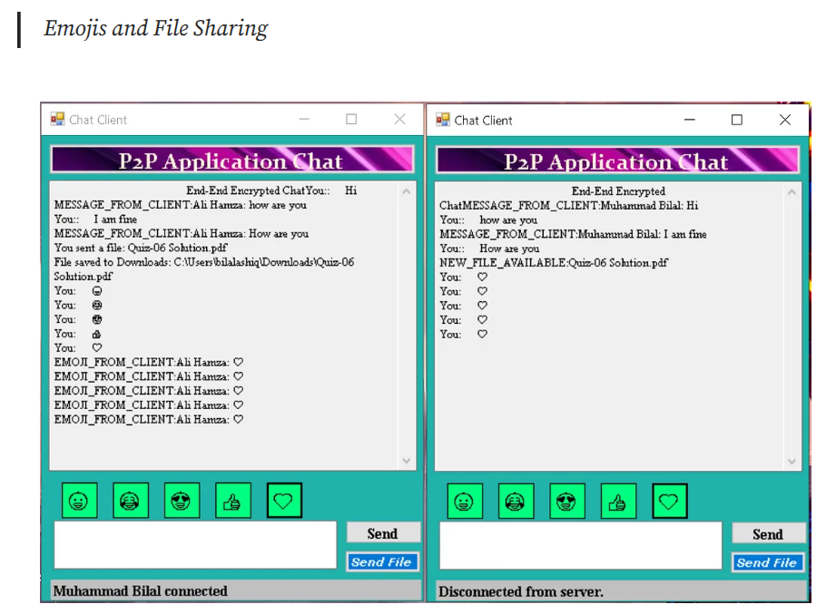

# 🌐 P2P Communication Application  
*A high-performance, decentralized peer-to-peer file-sharing and messaging system*  

  

## 🚀 Introduction  

The **P2P Communication Application** is a lightweight yet powerful project built using **C** and **C#** for seamless file sharing and messaging over a **peer-to-peer network**. This project is designed for Linux environments and leverages **computer networks** concepts, making it a great demonstration of **socket programming** and distributed systems.  

> Developed using **Visual Studio Code Community Edition** on **Linux**, this application ensures high-speed communication without relying on a central server.  

---

## 🎯 Features  

✅ **Decentralized Peer-to-Peer Communication**  
✅ **Fast & Secure File Sharing** (supports multiple formats: PDF, DOCX, JPG, PNG, TXT)  
✅ **Real-time Messaging with Emoji Support**  
✅ **File Version Control** - track and manage multiple versions  
✅ **Preview Before Download** - ensures file authenticity  
✅ **Multi-threaded** - simultaneous uploads and downloads  
✅ **Cross-Platform** - designed primarily for Linux, adaptable to Windows  

---

## 🛠️ Technologies Used  

- **Language:** C, C#  
- **Editor:** Visual Studio Code Community  
- **Networking:** Socket Programming  
- **Operating System:** Linux  
- **Concurrency:** Multi-threading for high efficiency  

---

## 📸 Screenshots  

  
*Secure user authentication before accessing the network*  

  
*Intuitive UI displaying active peers and shared files*  

  
*Fast, reliable, and secure file transfer between peers*  
*Real-time chat with emoji support*  

---

## 🔧 Installation Guide  

### 📌 Prerequisites  

Make sure you have the following installed:  

- **Linux OS**  
- **GCC Compiler** (`sudo apt install gcc` for Debian-based systems)  
- **Mono (for C# integration)** (`sudo apt install mono-complete`)  
- **Visual Studio Code** (optional, but recommended)  

### 📥 Clone the Repository  

```bash
git clone https://github.com/yourusername/p2p-communication-app.git
cd p2p-communication-app
